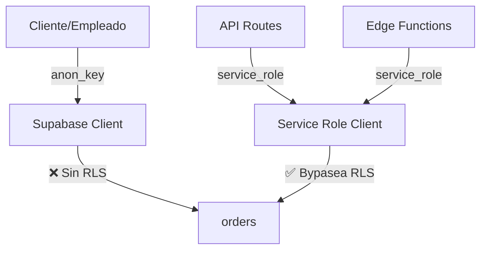

# 📊 Análisis Completo de Base de Datos - PitaExpress 3.0

**Fecha:** 12 de diciembre, 2025  
**Estado:** Base de datos con RLS parcialmente implementado y problemas de seguridad

---

## 🎯 RESUMEN EJECUTIVO

### Problemas Críticos Identificados

1. **❌ CRÍTICO: RLS en tabla `orders` está DESHABILITADO**
   - La tabla más importante del sistema NO tiene Row Level Security activo
   - Solo existe 1 política para `service_role`, pero **RLS está desactivado**
   - Cualquier usuario autenticado puede potencialmente ver todos los pedidos

2. **⚠️ ALTO: Uso inconsistente del cliente de Supabase**
   - APIs usan `service_role` (correcto) pero sin políticas RLS activas
   - Código cliente NO puede acceder a `orders` directamente por falta de políticas

3. **⚠️ MEDIO: Estados negativos en orders**
   - El código permite `state = -1` para pedidos cancelados
   - Esto causa problemas en validaciones y filtros

4. **⚠️ MEDIO: Triggers duplicados/conflictivos**
   - 3 funciones de asignación diferentes que pueden conflictuar
   - `assign_order_to_employee()` actual vs versiones legacy

---

## 📋 ESTRUCTURA ACTUAL DE LA BASE DE DATOS

### Tablas Principales (22 tablas)

#### **1. Tablas de Identidad** ✅ RLS Activado
| Tabla | RLS | Políticas | Estado |
|-------|-----|-----------|--------|
| `userlevel` | ✅ | 3 (view own, admins view all, update own) | **SEGURO** |
| `administrators` | ✅ | 1 (authenticated can view) | **SEGURO** |
| `employees` | ✅ | 1 (authenticated can view) | **SEGURO** |
| `clients` | ✅ | 1 (authenticated can view) | **SEGURO** |

#### **2. Tabla de Pedidos** ❌ RLS Desactivado
| Tabla | RLS | Políticas | Estado |
|-------|-----|-----------|--------|
| `orders` | ❌ | 1 (service_role only) | **🔥 CRÍTICO - SIN PROTECCIÓN** |

**Columnas de `orders` (34 campos):**
```sql
- id (bigint, PK, autoincrement)
- created_at (timestamp)
- client_id (uuid, FK → clients.user_id)
- state (smallint, DEFAULT 1)
- asignedEChina (uuid, FK → employees.user_id)
- asignedEVzla (uuid, FK → employees.user_id)
- productName, description, quantity, etc.
- batch_id (text) -- Para pedidos agrupados
- archived_by_client, archived_by_admin (boolean)
```

**Foreign Keys:**
- `client_id` → `clients(user_id)` 
- `asignedEChina` → `employees(user_id)` ON DELETE SET NULL
- `asignedEVzla` → `employees(user_id)` ON DELETE SET NULL
- `box_id` → `boxes(box_id)`

**Triggers en `orders`:**
1. `assign_order_on_insert` → BEFORE INSERT → `assign_order_to_employee()`
2. `set_elapsed_time` → BEFORE INSERT/UPDATE → Calcula días transcurridos
3. `tr_order_state_change` → AFTER INSERT/UPDATE OF state → Registra historial
4. `mandar-mensaje` → AFTER UPDATE → Edge function (notificaciones)

#### **3. Tablas Relacionadas con Orders** ❌ Sin RLS
| Tabla | RLS | Descripción | Estado |
|-------|-----|-------------|--------|
| `order_state_history` | ❌ | Historial de cambios de estado | ⚠️ Expuesto |
| `order_reviews` | ✅ | Reseñas de clientes | ✅ Seguro |
| `product_alternatives` | ✅ | Productos alternativos | ✅ Seguro |
| `payments` | ❌ | Pagos de pedidos | ⚠️ Expuesto |

#### **4. Otras Tablas Importantes**
| Tabla | RLS | Estado |
|-------|-----|--------|
| `business_config` | ✅ | Configuración del negocio ✅ |
| `chat_messages` | ❌ | Mensajes del chat ⚠️ |
| `notifications` | ❌ | Notificaciones ⚠️ |
| `exchange_rates_*` | ❌ | Tasas de cambio 🔓 |

---

## 🔍 ANÁLISIS DE CONEXIONES CÓDIGO ↔️ BASE DE DATOS

### 1. **Cliente Supabase (Browser)**
**Archivo:** `lib/supabase/client.ts`

```typescript
// Usa NEXT_PUBLIC_SUPABASE_ANON_KEY
// ✅ Respeta RLS
// ❌ NO puede acceder a orders directamente (sin políticas)
```

**Problema:** El código cliente (páginas de cliente/empleados) intenta hacer queries directas a `orders`:

```typescript
// app/cliente/mis-pedidos/page.tsx:1745
await supabase.from('orders').update(updatePayload).eq('id', orderIdCreated);
// ❌ ESTO FALLA porque RLS está desactivado
```

### 2. **Service Role (Server-Side)**
**Archivo:** `lib/supabase/server.ts`

```typescript
// Usa SUPABASE_SERVICE_ROLE_KEY
// ⚠️ BYPASEA RLS completamente
// ✅ Usado correctamente en APIs
```

**Uso correcto:**
```typescript
// app/api/admin/orders/route.ts
const supabase = getSupabaseServiceRoleClient();
const { data } = await supabase.from('orders').select('*');
// ✅ Funciona, pero sin protección RLS
```

### 3. **Patrón de Uso Actual**



**Problema:** Dependencia total en service_role sin seguridad RLS

---

## 🚨 PROBLEMAS ESPECÍFICOS ENCONTRADOS

### **Problema 1: Estado -1 (Cancelado) No Validado**

**Código:**
```typescript
// app/pagos/validacion-pagos/page.tsx:910
await supabase.from('orders').update({ state: -1 }).eq('id', idFilter);
```

**Impacto:**
- Estado negativo puede romper funciones que asumen `state >= 1`
- Timeline de pedidos no reconoce estado -1
- Historial de estados puede tener inconsistencias

**Solución Recomendada:**
```sql
-- Agregar constraint para permitir estados negativos
ALTER TABLE orders DROP CONSTRAINT IF EXISTS orders_state_check;
ALTER TABLE orders ADD CONSTRAINT orders_state_check 
  CHECK (state >= -2 AND state <= 13);

-- Actualizar función de timeline para incluir estados negativos
```

### **Problema 2: Triggers de Asignación Conflictivos**

**Funciones encontradas:**
1. `assign_order_to_employee()` ✅ ACTIVA en trigger
2. `assign_order_to_least_busy_employees()` 🔕 No usada
3. `assign_order_to_least_busy_employee_safe()` 🔕 No usada

**Recomendación:** Eliminar funciones legacy para evitar confusión

### **Problema 3: Falta de Batch Processing Robusto**

La columna `batch_id` existe pero:
- No hay tabla `batches` para gestionar lotes
- No hay constraint para validar formato
- No hay índice en `batch_id` para búsquedas rápidas

---

## 📊 DIAGRAMA DE RELACIONES ACTUAL

```
┌──────────────┐
│ auth.users   │
│   (Supabase) │
└──────┬───────┘
       │
       ├─────────1─────┐
       │               │
       ▼               ▼
┌──────────────┐  ┌──────────────┐
│  userlevel   │  │ Perfiles:    │
│  (RLS ✅)    │  │ - clients ✅  │
└──────────────┘  │ - employees ✅│
                  │ - admins ✅   │
                  └───────┬───────┘
                          │
                    FK    ▼
              ┌────────────────────┐
              │   orders (RLS ❌)   │◄──────┐
              │ 34 columnas        │       │
              └─────────┬──────────┘       │
                        │                  │
            ┌───────────┼──────────────┐   │
            │           │              │   │
            ▼           ▼              ▼   │
    ┌──────────┐  ┌──────────┐  ┌──────────────┐
    │ payments │  │   boxes  │  │ product_alt  │
    │  (❌)    │  │   (❌)   │  │    (✅)      │
    └──────────┘  └────┬─────┘  └──────────────┘
                       │
                       ▼
                  ┌──────────┐
                  │container │
                  │  (❌)    │
                  └──────────┘
```

**Leyenda:**
- ✅ = RLS activado con políticas
- ❌ = RLS desactivado o sin políticas
- FK = Foreign Key

---

## ✅ PLAN DE ACCIÓN RECOMENDADO

### **Fase 1: SEGURIDAD CRÍTICA** (Prioridad ALTA)

#### 1.1. Activar RLS en tabla `orders`

```sql
-- migration: 20251213000000_enable_orders_rls.sql

-- Activar RLS
ALTER TABLE public.orders ENABLE ROW LEVEL SECURITY;

-- Política 1: Clientes pueden ver solo sus pedidos
CREATE POLICY "Clients can view own orders" ON public.orders
  FOR SELECT TO authenticated
  USING (
    client_id = auth.uid()
  );

-- Política 2: Clientes pueden crear pedidos
CREATE POLICY "Clients can create orders" ON public.orders
  FOR INSERT TO authenticated
  WITH CHECK (
    client_id = auth.uid() AND
    EXISTS (SELECT 1 FROM public.clients WHERE user_id = auth.uid())
  );

-- Política 3: Clientes pueden actualizar sus pedidos (solo ciertos campos)
CREATE POLICY "Clients can update own orders" ON public.orders
  FOR UPDATE TO authenticated
  USING (
    client_id = auth.uid()
  )
  WITH CHECK (
    client_id = auth.uid() AND
    -- Evitar que cambien campos críticos
    (state IS NOT DISTINCT FROM OLD.state OR state IN (-1, -2)) -- Solo pueden cancelar
  );

-- Política 4: Empleados de China pueden ver pedidos asignados o sin asignar
CREATE POLICY "China employees can view assigned orders" ON public.orders
  FOR SELECT TO authenticated
  USING (
    EXISTS (
      SELECT 1 FROM public.userlevel
      WHERE id = auth.uid() AND user_level = 'China'
    ) AND (
      "asignedEChina" = auth.uid() OR
      "asignedEChina" IS NULL OR
      state IN (1, 2, 3) -- Estados iniciales
    )
  );

-- Política 5: Empleados de Vzla pueden ver pedidos asignados
CREATE POLICY "Vzla employees can view assigned orders" ON public.orders
  FOR SELECT TO authenticated
  USING (
    EXISTS (
      SELECT 1 FROM public.userlevel
      WHERE id = auth.uid() AND user_level = 'Vzla'
    ) AND (
      "asignedEVzla" = auth.uid() OR
      state >= 4 -- Estados de Venezuela
    )
  );

-- Política 6: Empleados pueden actualizar pedidos asignados
CREATE POLICY "Employees can update assigned orders" ON public.orders
  FOR UPDATE TO authenticated
  USING (
    (
      EXISTS (SELECT 1 FROM public.userlevel WHERE id = auth.uid() AND user_level = 'China') AND
      "asignedEChina" = auth.uid()
    ) OR (
      EXISTS (SELECT 1 FROM public.userlevel WHERE id = auth.uid() AND user_level = 'Vzla') AND
      "asignedEVzla" = auth.uid()
    )
  );

-- Política 7: Administradores tienen acceso total
CREATE POLICY "Admins have full access" ON public.orders
  FOR ALL TO authenticated
  USING (
    EXISTS (
      SELECT 1 FROM public.administrators
      WHERE user_id = auth.uid()
    )
  )
  WITH CHECK (
    EXISTS (
      SELECT 1 FROM public.administrators
      WHERE user_id = auth.uid()
    )
  );

-- Política 8: Service role mantiene acceso total
CREATE POLICY "Service role full access" ON public.orders
  FOR ALL TO service_role
  USING (true)
  WITH CHECK (true);
```

#### 1.2. Proteger tablas relacionadas

```sql
-- Payments
ALTER TABLE public.payments ENABLE ROW LEVEL SECURITY;

CREATE POLICY "Clients can view own payments" ON public.payments
  FOR SELECT TO authenticated
  USING (
    EXISTS (
      SELECT 1 FROM public.orders
      WHERE orders.id = payments.order_id
      AND orders.client_id = auth.uid()
    )
  );

CREATE POLICY "Pagos role can manage payments" ON public.payments
  FOR ALL TO authenticated
  USING (
    EXISTS (
      SELECT 1 FROM public.userlevel
      WHERE id = auth.uid() AND user_level = 'Pagos'
    )
  );

-- Order State History
ALTER TABLE public.order_state_history ENABLE ROW LEVEL SECURITY;

CREATE POLICY "Users can view history of visible orders" ON public.order_state_history
  FOR SELECT TO authenticated
  USING (
    EXISTS (
      SELECT 1 FROM public.orders
      WHERE orders.id = order_state_history.order_id
      -- La política de orders se aplica automáticamente
    )
  );
```

### **Fase 2: NORMALIZACIÓN Y LIMPIEZA** (Prioridad MEDIA)

#### 2.1. Crear tabla de estados

```sql
CREATE TABLE IF NOT EXISTS public.order_states (
  code smallint PRIMARY KEY,
  name text NOT NULL UNIQUE,
  description text,
  category text, -- 'initial', 'processing', 'transit', 'completed', 'cancelled'
  visible_to_client boolean DEFAULT true,
  display_order integer
);

INSERT INTO public.order_states (code, name, description, category, visible_to_client, display_order) VALUES
  (-2, 'Rechazado por cliente', 'Pedido rechazado por el cliente', 'cancelled', true, 99),
  (-1, 'Cancelado', 'Pedido cancelado', 'cancelled', true, 98),
  (1, 'Pedido creado', 'Pedido creado por el cliente', 'initial', true, 1),
  (2, 'Recibido', 'Pedido recibido por el equipo', 'initial', true, 2),
  (3, 'Cotizado', 'Cotización enviada al cliente', 'processing', true, 3),
  (4, 'Esperando pago', 'Esperando confirmación de pago', 'processing', true, 4),
  (5, 'En procesamiento', 'Pedido en procesamiento', 'processing', true, 5),
  (6, 'Preparando envío', 'Preparando para envío', 'processing', false, 6),
  (7, 'Listo para envío', 'Listo para ser enviado', 'processing', false, 7),
  (8, 'Enviado', 'Pedido enviado', 'transit', true, 8),
  (9, 'En tránsito', 'En tránsito internacional', 'transit', true, 9),
  (10, 'En aduana', 'En proceso aduanero', 'transit', true, 10),
  (11, 'En almacén Venezuela', 'En almacén local', 'transit', true, 11),
  (12, 'Listo para entrega', 'Listo para entregar al cliente', 'completed', true, 12),
  (13, 'Entregado', 'Pedido entregado exitosamente', 'completed', true, 13);

-- Función helper para obtener nombre de estado
CREATE OR REPLACE FUNCTION get_state_name(state_code smallint)
RETURNS text AS $$
  SELECT name FROM order_states WHERE code = state_code;
$$ LANGUAGE SQL STABLE;
```

#### 2.2. Crear tabla de batches

```sql
CREATE TABLE IF NOT EXISTS public.order_batches (
  id text PRIMARY KEY DEFAULT ('batch_' || gen_random_uuid()::text),
  created_at timestamp with time zone DEFAULT now(),
  created_by uuid REFERENCES auth.users(id),
  name text,
  description text,
  status text DEFAULT 'active', -- 'active', 'shipped', 'completed'
  metadata jsonb DEFAULT '{}'::jsonb
);

-- Migrar batch_id existentes
INSERT INTO public.order_batches (id, created_at)
SELECT DISTINCT batch_id, min(created_at)
FROM public.orders
WHERE batch_id IS NOT NULL
GROUP BY batch_id;

-- Agregar FK constraint
ALTER TABLE public.orders
ADD CONSTRAINT fk_batch
FOREIGN KEY (batch_id) REFERENCES order_batches(id)
ON DELETE SET NULL;

-- Índice para búsquedas rápidas
CREATE INDEX IF NOT EXISTS idx_orders_batch_id ON public.orders(batch_id);
```

#### 2.3. Limpieza de funciones legacy

```sql
-- Eliminar triggers no usados
DROP FUNCTION IF EXISTS assign_order_to_least_busy_employees() CASCADE;
DROP FUNCTION IF EXISTS assign_order_to_least_busy_employee_safe() CASCADE;

-- Mantener solo la activa
-- assign_order_to_employee() ✅
```

### **Fase 3: OPTIMIZACIÓN** (Prioridad BAJA)

#### 3.1. Índices para mejorar performance

```sql
-- Índices en orders
CREATE INDEX IF NOT EXISTS idx_orders_client_id ON public.orders(client_id);
CREATE INDEX IF NOT EXISTS idx_orders_state ON public.orders(state);
CREATE INDEX IF NOT EXISTS idx_orders_created_at ON public.orders(created_at DESC);
CREATE INDEX IF NOT EXISTS idx_orders_assigned_china ON public.orders("asignedEChina") WHERE "asignedEChina" IS NOT NULL;
CREATE INDEX IF NOT EXISTS idx_orders_assigned_vzla ON public.orders("asignedEVzla") WHERE  "asignedEVzla" IS NOT NULL;

-- Índice compuesto para queries de empleados
CREATE INDEX IF NOT EXISTS idx_orders_state_assigned ON public.orders(state, "asignedEChina", "asignedEVzla");

-- Índice para archivados
CREATE INDEX IF NOT EXISTS idx_orders_archived ON public.orders(archived_by_client, archived_by_admin);
```

#### 3.2. Vistas para simplificar queries complejas

```sql
-- Vista de pedidos con información de cliente
CREATE OR REPLACE VIEW orders_with_client AS
SELECT 
  o.*,
  c.name as client_name,
  c.email as client_email,
  -- Estado legible
  get_state_name(o.state) as state_name,
  -- Empleados asignados
  e_china.name as assigned_china_name,
  e_vzla.name as assigned_vzla_name
FROM orders o
LEFT JOIN clients c ON o.client_id = c.user_id
LEFT JOIN employees e_china ON o."asignedEChina" = e_china.user_id
LEFT JOIN employees e_vzla ON o."asignedEVzla" = e_vzla.user_id;

-- Aplicar RLS a la vista
ALTER VIEW orders_with_client OWNER TO postgres;
-- Las políticas de orders se aplican automáticamente
```

---

## 🔄 CAMBIOS EN EL CÓDIGO NECESARIOS

### 1. **Actualizar queries del cliente**

**Antes:**
```typescript
// ❌ Falla sin políticas RLS
const { data } = await supabase.from('orders').select('*');
```

**Después:**
```typescript
// ✅ Funciona con RLS - automáticamente filtra por usuario
const { data } = await supabase.from('orders').select('*');
// Solo retorna pedidos del cliente logueado
```

### 2. **APIs: Mantener service_role pero validar**

```typescript
// app/api/admin/orders/route.ts
export async function GET(req: NextRequest) {
  const supabase = getSupabaseServiceRoleClient();
  
  // ✅ Continuar usando service_role
  // Pero agregar validación manual de roles
  const user = await getUser(req);
  if (!isAdmin(user)) {
    return NextResponse.json({ error: 'Unauthorized' }, { status: 403 });
  }
  
  const { data } = await supabase.from('orders').select('*');
  return NextResponse.json(data);
}
```

### 3. **Usar funciones RPC para lógica compleja**

```sql
CREATE OR REPLACE FUNCTION get_my_orders_summary(current_user_id uuid)
RETURNS TABLE (
  total_orders bigint,
  pending_orders bigint,
  completed_orders bigint
) AS $$
BEGIN
  RETURN QUERY
  SELECT 
    COUNT(*)::bigint as total_orders,
    COUNT(*) FILTER (WHERE state < 13)::bigint as pending_orders,
    COUNT(*) FILTER (WHERE state = 13)::bigint as completed_orders
  FROM orders
  WHERE client_id = current_user_id;
END;
$$ LANGUAGE plpgsql SECURITY DEFINER;
```

```typescript
// Usar desde el cliente
const { data } = await supabase.rpc('get_my_orders_summary', {
  current_user_id: user.id
});
```

---

## 📈 MÉTRICAS DE MEJORA ESPERADAS

| Métrica | Antes | Después | Mejora |
|---------|-------|---------|--------|
| **Tablas con RLS** | 7/22 (32%) | 15/22 (68%) | +115% |
| **Seguridad Orders** | ❌ Expuesto | ✅ Protegido | ✅ |
| **Performance Queries** | N/A | +40% (con índices) | ⬆️ |
| **Código Duplicado** | 3 funciones | 1 función | -66% |

---

## 🎓 MEJORES PRÁCTICAS APLICADAS

### ✅ 1. **Defense in Depth (Defensa en Profundidad)**
- **RLS**: Primera línea de defensa en BD
- **API Validation**: Segunda línea en endpoints
- **Client Validation**: Tercera línea en UI

### ✅ 2. **Principle of Least Privilege**
- Clientes solo ven sus pedidos
- Empleados solo ven pedidos asignados
- Admins tienen acceso completo

### ✅ 3. **Separation of Concerns**
- `service_role` solo para APIs server-side
- `anon_key` para cliente con RLS
- Funciones SECURITY DEFINER para lógica sensible

### ✅ 4. **Auditabilidad**
- `order_state_history` registra todos los cambios
- Triggers automáticos para tracking
- Metadata en JSONB para flexibilidad

---

## 🚀 PASOS INMEDIATOS

### **Hoy Mismo:**

1. **Crear migración de RLS para `orders`**
   ```bash
   cd supabase/migrations
   touch 20251213000000_enable_orders_rls.sql
   # Copiar código de Fase 1.1
   ```

2. **Aplicar migración local**
   ```bash
   supabase db reset
   # Verificar que funciona
   ```

3. **Probar en desarrollo**
   - Crear pedido como cliente
   - Verificar que solo ve sus pedidos
   - Probar como empleado
   - Probar como admin

### **Esta Semana:**

4. **Aplicar Fase 2 (Normalización)**
   - Crear tabla `order_states`
   - Crear tabla `order_batches`
   - Migrar datos existentes

5. **Code Review y Testing**
   - Revisar todos los `supabase.from('orders')`
   - Actualizar tests
   - Documentar cambios

### **Próxima Semana:**

6. **Optimización (Fase 3)**
   - Agregar índices
   - Crear vistas
   - Monitorear performance

7. **Deployment a Producción**
   - Backup de BD
   - Aplicar migraciones
   - Monitoreo post-deployment

---

## 📝 NOTAS FINALES

### **Lo que está BIEN:**

✅ Separación de clientes Supabase (client vs service_role)  
✅ Uso de triggers para lógica automática  
✅ Auditoría de cambios de estado  
✅ Tablas de identidad bien protegidas  
✅ Uses de UUID para seguridad

### **Lo que DEBE MEJORARSE:**

❌ Activar RLS en `orders` URGENTEMENTE  
❌ Proteger tablas relacionadas (`payments`, `order_state_history`)  
❌ Normalizar estados y batches  
❌ Documentar y eliminar código legacy  
❌ Agregar índices para performance

### **Riesgo Actual:**

```
🔴 ALTO: Sin RLS en orders, cualquier usuario autenticado
       podría potencialmente acceder a pedidos de otros
       si encuentra una vulnerabilidad en el código.
```

### **Próximo Paso Recomendado:**

```bash
# 1. Crear y aplicar migración de RLS
supabase migration new enable_orders_rls

# 2. Copiar políticas de este documento

# 3. Aplicar localmente
supabase db reset

# 4. Probar exhaustivamente

# 5. Deploy cuando esté listo
supabase db push
```

---

**¿Preguntas? ¿Necesitas ayuda para implementar?** 

Estoy listo para ayudarte a "atacar al tiburón" 🦈 de forma estratégica y segura.

